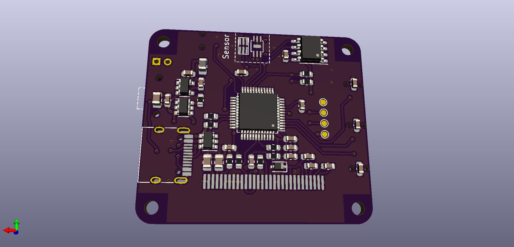

# Overview
An EV(Exposure Value) Meter measures EV parameters for cameras automatically. Also measures the Color Temperature.Designed to simplify MF controls on Digital or Mechanical DSLRs

## Status
Still Under Developing.  

## Hardware design
Tools: KiCad  
See dir: Hardware/Kicad_project   

## Software design

**History Version**

- V1.0
  - Tools: Clion + STM32CubeMx  
  - MCU: STM32F070F6P6  
  - See dir: Software

- V2.0
  - Tools: Clion + STM32CubeMx
  - MCU: STM32F072CBT6
  - See dir: Software
