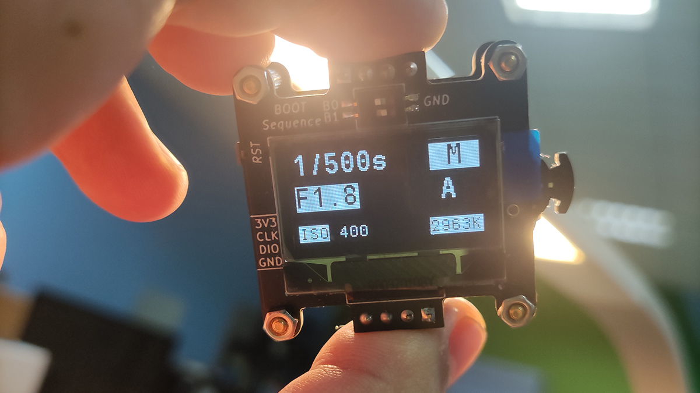

# Overview
An EV(Exposure Value) Meter measures EV parameters for cameras automatically. Also measures the Color Temperature.Designed to simplify MF controls on Digital or Mechanical DSLRs

## Progress

V2.1 has been updated: Basic functions completed, **but bug exists**.  

## Hardware design
Tools: KiCad  
See dir: Hardware/Kicad_project

## Software design

**History Version**

- V1.0
  - Tools: Clion + STM32CubeMx  
  - MCU: STM32F070F6P6  
  - See dir: Software

- V2.0
  - Tools: Clion + STM32CubeMx
  - MCU: STM32F072CBT6
  - See dir: Software

- V2.1
  - Tools: MDK5 + STM32CubeMx
  - MCU: STM32F072CBT6
  - See dir: Software

